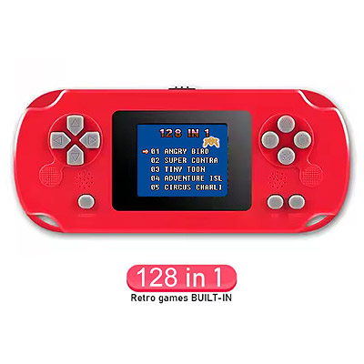
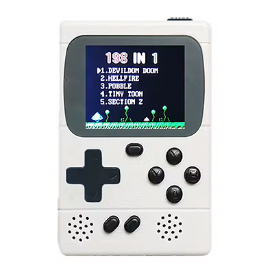
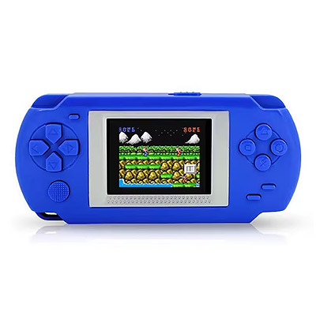
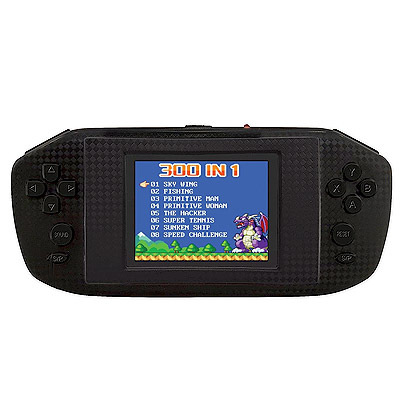
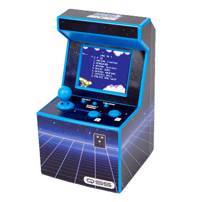
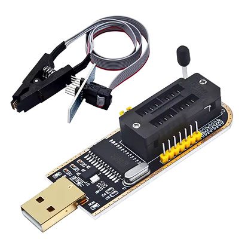
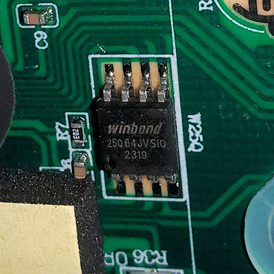

# ROM Extraction Utility
A command line utility to extract the roms from firmware dumps of various handhelds.

## Supported Devices
The following devices are currently supported:

| Name | Photo | Link |
| --- | --- | --- |
| Gaminja GC31 / Gameruns Retrogame |  | ([on nesdev](https://forums.nesdev.org/viewtopic.php?p=298744#p298744)) |
| Gaminja GC36 / Gameruns Retro Game Box |  | ([on nesdev](https://forums.nesdev.org/viewtopic.php?p=298602#p298602)) |
| HKB-502 |  | ([on nesdev](https://forums.nesdev.org/viewtopic.php?p=252679#p252679)) |
| Lexibook JL3000 Power Cyber Arcade |  | ([on nesdev](https://forums.nesdev.org/viewtopic.php?p=265765&hilit=dump#p265765)) |
| Oplayer MGS2401A |  | ([on nesdev](https://forums.nesdev.org/viewtopic.php?p=257743#p257743)) |
| Thumbs Up Orb Retro Arcade |  | ([on nesdev](https://forums.nesdev.org/viewtopic.php?p=284160#p284160)) |
| QSS Retro Arcade |  | ([on nesdev](https://forums.nesdev.org/viewtopic.php?p=300556#p300556)) |

## Running the Script
Examples of typical execution:
```
python extract_roms.py -f "hkb-502.bin" -d hkb-502 -o dump\hkb-502 -g
python extract_roms.py -f "jl3000.bin" -d jl3000 -o dump\jl3000 -g
python extract_roms.py -f "mini_arcade.bin" -d mini_arcade -o dump\mini_arcade -g
python extract_roms.py -f "oplayer.bin" -d oplayer -o dump\oplayer -g
python extract_roms.py -f "retro_game_box.bin" -d retro_game_box -o dump\retro_game_box -g
python extract_roms.py -f "retrogame" -d retrogame -o dump\retrogame -g
python extract_roms.py -f "qss.bin" -d qss -o dump\qss -g
```

## Replacing ROMs

The -g option outputs additional information that can be used to _manually replace_ one of the existing roms in your dump.

1. Find an existing rom in the output that matches the same PRG and CHR size as the rom you'd like to replace it with.
2. Use a utility like [famiROM](https://gbatemp.net/download/famirom-2019-01-13.37661/download) or [NES Rom Splitter](https://www.romhacking.net/utilities/683/) to split up the new rom into separate chunks of PRG and CHR data.
3. Then use a hex editor like [HxD](https://mh-nexus.de/en/downloads.php?product=HxD20) to paste the respective chunks in the firmware dump at the hex addresses given with the -g option, overwriting the existing data.
4. Locate the title with a text search and replace it with the title of your new rom, making sure not to overflow the provided title space.

```
extracting dump\qss\Vangvard.nes (mapper 4) from data:
    4C 00 F0 12 08 00 D0 02 00 :: 128k PRG @ 0020000 / 128k CHR @ 05A0000
    02 60 81 02 10 11 1E 1F 00
```

## Dumping and Programming Firmware
The most friendly firmwares are on 8-pin serial flash memory chips, often from Winbond. These are relatively easy to dump using the inexpensive CH341A programmer. You'll also need a test clip to go along with it, or specialty test hooks for SMD components. Larger NAND flash chips are also common but are much more complicated to dump.

| Description | Photo |
| --- | --- |
| CH341A programmer with test clip |  |
| Typical flash chip |  |

## New Devices

Generally, code change is going to be required to support a new device, but if the device happens to use the same data formats as one of the already supported devices, then you can pass that device name and override the data addresses using the various command line options.

```
>python extract_roms.py


usage: extract_roms.py [--help] [-f FILENAME] [-t TITLES] [-b BANKS] [-z SIZE] [-s SEPARATOR] [-e END]
                       [-d {jl3000,mini_arcade,retro_game_box,retrogame,qss}] [-c COUNT] [-o OUTDIR] [-g]

Extracts roms from a multicart dump.

options:
  --help
  -f FILENAME, --filename FILENAME
                        Input filename.
  -t TITLES, --titles TITLES
                        Address of title information, e.g. 0xA03F.
  -b BANKS, --banks BANKS
                        Address of bank information, e.g. 0x6A000.
  -z SIZE, --size SIZE  Size of each bank data entry, e.g. 9.
  -s SEPARATOR, --separator SEPARATOR
                        Character used to separate titles, e.g. 255.
  -e END, --end END     Character used to end titles, e.g. 0.
  -d {jl3000,mini_arcade,retro_game_box,retrogame,qss}, --device {jl3000,mini_arcade,retro_game_box,retrogame,qss}
                        Device name (automatically sets values for the required arguments).
  -c COUNT, --count COUNT
                        Max number of roms to parse, e.g. 10.
  -o OUTDIR, --outdir OUTDIR
                        Output directory.
  -g, --debug           Enable debug output.

Pass the required arguments to begin parsing roms.
```

## License
Licensed under [CC BY-NC-SA 4.0](https://creativecommons.org/licenses/by-nc-sa/4.0/deed.en).
